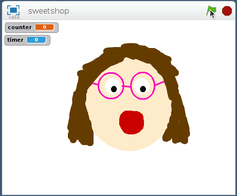

## Introduction
Some penny sweets or candy can make great input devices for a game using a Raspberry Pi.

## What you will make
Turn a squidgy sweet into an input button for your Raspberry Pi. You will then create a reaction game in Scratch that counts how many times a player can squeeze your sweet input device in ten seconds!

## What you will learn

This resource covers elements from the following strands of the [Raspberry Pi Digital Making Curriculum](https://www.raspberrypi.org/curriculum/):

- [Design basic 2D and 3D assets](https://www.raspberrypi.org/curriculum/design/creator)
- [Use basic programming constructs to create simple programs](https://www.raspberrypi.org/curriculum/programming/creator)
- [Use basic digital, analogue, and electromechanical components](https://www.raspberrypi.org/curriculum/physical-computing/creator)
