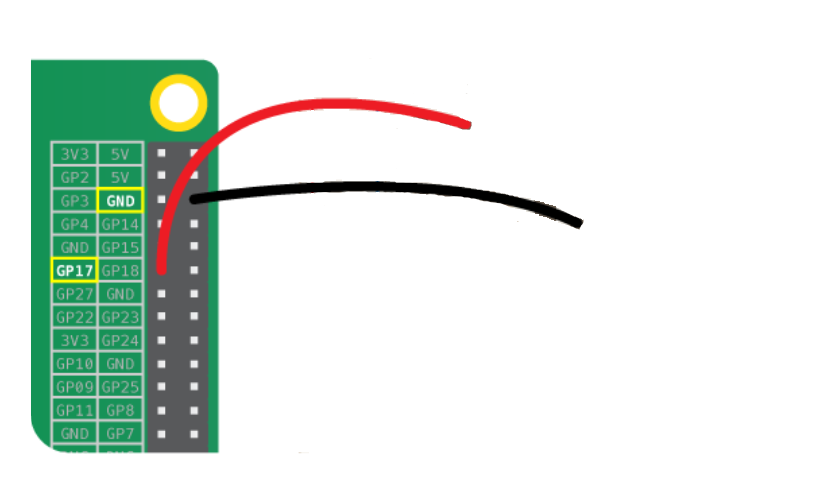

## Wire up your sweet button

Let's connect a sweet or piece of candy to your Raspberry Pi to act as a button.

- Unfold a paperclip to make a straight wire, then insert one end into one of the female-to-female jumper cables.

- Repeat this for to the other jumper cable so that you have two identical jumper cables with wires inserted in the ends.

- Insert the other end of both paper clip wires into a soft sweet so that they are close to each other but not touching. This is a bit tricky to get right, but we will test it once the cables are connected to the Raspberry Pi.

[[[rpi-gpio-pin-label]]]

- Take the free end of one of the jumper cables and push it onto GPIO 17 on your Raspberry Pi.

- Take the end of the other jumper cable and push onto a pin labelled 'GND' which connects the wire to ground.
