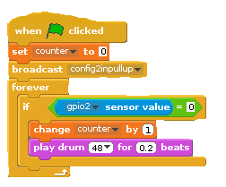
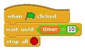

## Reaction game

The object of the game is to see how many times you can squeeze the sweet button in ten seconds.

You will need to create two variables for this game: one to count the button presses, and one to count time.

- Click on **variables** from the blocks palette and select `make a variable`. Name the first variable **counter** and click **ok**.

- Repeat the first step to create another variable named **timer**.

- Click on the control blocks palette and drag the `When green flag clicked` block on to the scripts tab of your face sprite.

- Next, add the variable block `set counter to 0` so that at the start of each game the counter is reset to 0, ready to test the player's button-pushing skills.

- Configure pin 3 (GPIO2) as an input with a pull-up by sending the broadcast message "config2inpullup"

- Add a `forever` looping block, connect it and then place an `if` block inside the `forever` block.

- There is a small blank space on the `if` block; this is so that you can add other blocks. In this space, you first need to add the **operator** block ` = `.

- Blocks can be added on either side of the `=` block. On the left hand side add the sensing block `slider sensor value` and on the right hand side type the value `0`. Using the drop-down menu change **slider** to **gpio2**.

- Inside the `if` block add the variable block `change counter by 1` and `play drum 48 for 0.2 beats`. You can select any drum noise that you like from the drop down menu.

	

To set a time limit that counts upwards for the game, you need to add two further scripts:

- Add `when green flag clicked` block to the scripts and connect the sensing block `reset timer` to it.

- Underneath, connect a `forever` looping control block.

- Inside the loop add the variable block `set control to 0` and using the drop-down menu on the block, change **control** to **timer** so that the block reads `set timer to 0`.

- Replace the value `0` in the `set timer to 0` block with the operator block `round`.

- Then add the sensing block `timer` inside the space on the `round' block. The completed block should look like:

	

- Add another `when green flag clicked` control block to the scripts area and connect a `wait until` block to it.

- Add the operators block `=` to the space in the `wait until` block. In the left hand space, add the variable block `timer`. On the right hand side, type a value to represent time. If you want your game to last for ten seconds, type `10`.

- Connect a `stop all` control block to the end of this script.

- Finally, save your game by clicking on the save icon at the top of the screen.

	
