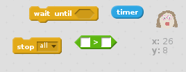

## Add a timer

Finally, let's add a timer so that the player only has 10 seconds to press the sweet button as many times as they can.

Scratch has a built in timer you can use, in the `sensing`{:class="blocksensing"} block section.

+ Add some code to `reset timer`{:class="blocksensing"} when the green flag is clicked.

```blocks
when flag clicked
reset timer
```

+ Now use the same block you used to prevent the cheating in the previous step - `wait until`{:class="blockcontrol"}. This time, add some blocks after you reset the timer to wait until the timer is greater than 10, and then stop all scripts.

--- hints ---
--- hint ---
Your code should `wait until`{:class="blockcontrol"} the `timer`{:class="blocksensing"} is `greater than (>)`{:class="blockoperators"} 10 and then `stop all`{:class="blockcontrol"} scripts.
--- /hint ---
--- hint ---
Here are the blocks you will need:

--- /hint ---
--- hint ---
Here is how your finished code should look:
```blocks
when flag clicked
reset timer
wait until <(timer) > [10]>
stop [all v]
```
--- /hint ---
--- /hints ---

+ Click on the green flag and test your code. You should be able to press the sweet button and see the counter increasing for each press. Once the timer reaches 10, any button presses will no longer add one to counter.

Note that the timer will continue to run on past 10 seconds, but all of your other scripts will stop.
